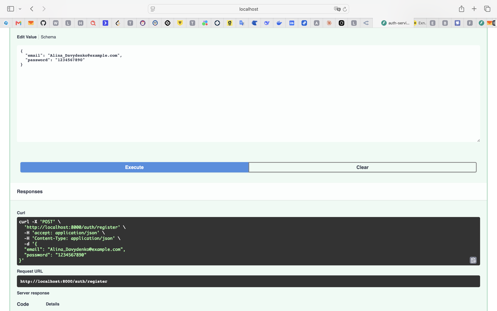
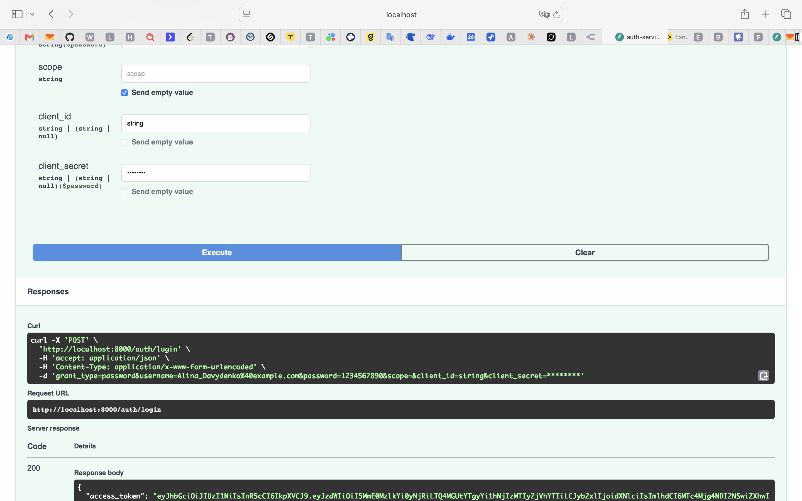
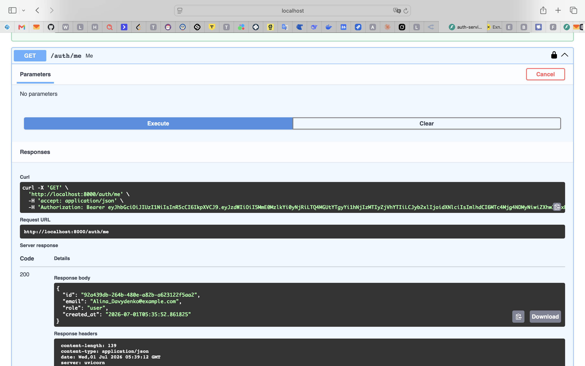
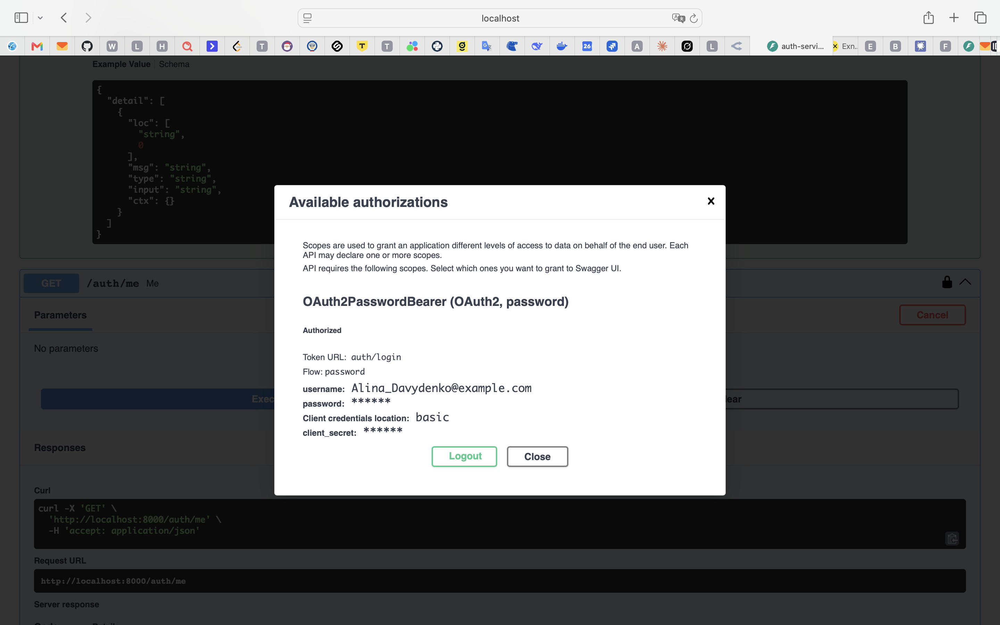
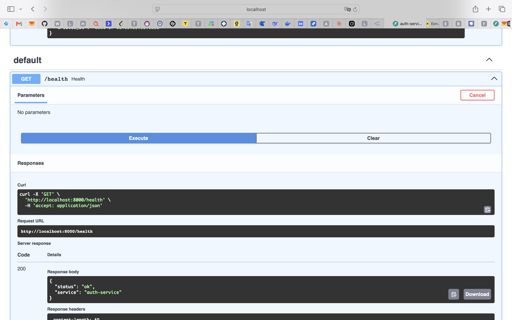

# Итоговый проект: Двухсервисная система LLM-консультаций

Распределённая система из двух независимых сервисов:

- **Auth Service** (FastAPI) — регистрация, логин, выпуск и проверка JWT.
- **Bot Service** (aiogram + FastAPI + Celery + RabbitMQ + Redis) — Telegram-бот,
  который доверяет только валидному JWT, выданному Auth Service, и обрабатывает
  запросы к LLM (OpenRouter) асинхронно через очередь.

## Архитектура

```
                 ┌────────────────────┐
  Swagger/curl → │   Auth Service     │  → SQLite (users)
                 │  (FastAPI, :8000)  │
                 └─────────┬──────────┘
                           │ выдаёт JWT (HS256: sub, role, iat, exp)
                           ▼
                 пользователь копирует токен
                           │
                           ▼
                 ┌────────────────────┐        ┌───────────┐
  Telegram  ───► │    Bot Service     │  ───►  │ RabbitMQ  │
                 │  (aiogram polling) │        │ (broker)  │
                 └─────────┬──────────┘        └─────┬─────┘
                           │ token:<tg_user_id>       │
                           ▼                          ▼
                 ┌────────────────────┐        ┌───────────────┐
                 │       Redis        │ ◄────  │ Celery worker │
                 │ (кэш токенов +     │        │  (llm_request)│
                 │  result backend)   │        └───────┬───────┘
                 └────────────────────┘                │
                                                         ▼
                                                  OpenRouter API
```

Ключевой принцип: **Bot Service не хранит пользователей, не создаёт токены и не
знает ничего о паролях.** Он умеет только проверять подпись и срок жизни JWT
(общий `JWT_SECRET`, алгоритм `HS256`). JWT создаётся исключительно в Auth
Service.

## Структура репозитория

```
auth_service/
  app/
    core/        # config, security (hash/JWT), exceptions
    db/          # SQLAlchemy Base, async engine/session, ORM-модели
    schemas/     # pydantic-схемы auth/user
    repositories/# доступ к БД (users)
    usecases/    # бизнес-логика register/login/me
    api/         # deps (DI), routes_auth, router
    main.py      # композиция приложения
  tests/
    test_security.py         # unit: хеширование паролей, JWT
    test_auth_integration.py # integration: register → login → me (httpx ASGITransport)

bot_service/
  app/
    core/        # config, jwt.py (только валидация токена)
    infra/       # redis.py, celery_app.py
    services/    # openrouter_client.py
    tasks/       # llm_tasks.py (Celery task "llm_request")
    bot/         # dispatcher.py, handlers.py, entrypoint.py (polling)
    main.py      # FastAPI health-check
  tests/
    test_jwt.py         # unit: валидация JWT
    test_handlers.py     # mock: /token и текстовые сообщения (fakeredis, pytest-mock)
    test_openrouter.py   # integration: клиент OpenRouter через respx (без сети)

docker-compose.yml   # rabbitmq, redis, auth_service, bot_service (web),
                      # bot_polling (aiogram polling), celery_worker
```

## Пользовательский сценарий

1. Пользователь открывает Swagger Auth Service: `http://localhost:8000/docs`.
2. `POST /auth/register` — регистрация (`email` в формате `surname@email.com`, `password`).
3. `POST /auth/login` — логин (form-data: `username`, `password`) → получает `access_token`.
4. `GET /auth/me` с заголовком `Authorization: Bearer <token>` — проверка профиля.
5. В Telegram пользователь отправляет боту `/token <jwt>` — бот сохраняет токен в Redis
   под ключом `token:<tg_user_id>`.
6. Любое следующее текстовое сообщение боту:
   - если токен валиден — публикуется задача `llm_request` в RabbitMQ, Celery worker
     дергает OpenRouter и присылает ответ пользователю в Telegram;
   - если токена нет или он невалиден/истёк — бот отвечает отказом и просит
     авторизоваться через Auth Service.

## Запуск через Docker Compose

```bash
docker compose up --build
```

Поднимутся:
- `rabbitmq` — брокер задач Celery, UI на `http://localhost:15672` (guest/guest)
- `redis` — кэш токенов и result backend
- `auth_service` — Swagger на `http://localhost:8000/docs`
- `bot_service` — health-check на `http://localhost:8001/health`
- `bot_polling` — процесс aiogram polling (получает сообщения из Telegram)
- `celery_worker` — обработчик задач `llm_request`

Перед запуском заполните `bot_service/.env`:
- `TELEGRAM_BOT_TOKEN` — токен бота от @BotFather
- `OPENROUTER_API_KEY` — ключ OpenRouter

И `auth_service/.env` / `bot_service/.env` — единый `JWT_SECRET` в обоих файлах
(значения уже совпадают по умолчанию, но в проде замените на реальный секрет).

## Локальный запуск без Docker

### Auth Service

```bash
cd auth_service
uv sync
uv run uvicorn app.main:app --reload --port 8000
```

### Bot Service (три процесса)

```bash
cd bot_service
uv sync

# 1) FastAPI health-check (опционально)
uv run uvicorn app.main:app --reload --port 8001

# 2) Celery worker (нужен запущенный RabbitMQ + Redis)
uv run celery -A app.infra.celery_app.celery_app worker --loglevel=info

# 3) Telegram polling
uv run python -m app.bot.entrypoint
```

## Тесты

Тесты не требуют Docker, реального Redis/RabbitMQ или сети — используются
in-memory SQLite, `fakeredis`, `pytest-mock` и `respx`.

```bash
cd auth_service && uv run pytest -v
cd bot_service && uv run pytest -v
```

Ожидаемый результат: `auth_service` — 11 тестов (unit: пароли/JWT,
integration: полный HTTP-сценарий register/login/me + негативные кейсы 409/401);
`bot_service` — 7 тестов (unit: валидация JWT, mock: обработчики `/token` и
текстовых сообщений через Redis/Celery, integration: клиент OpenRouter через respx).

## Скриншоты (для сдачи проекта)








- [ ] Диалог с Telegram-ботом: `/token`, отправка сообщения, получение ответа LLM
- [ ] Интерфейс RabbitMQ Management с активными очередями/consumers
- [ ] Вывод `pytest` для обоих сервисов (все тесты зелёные)


